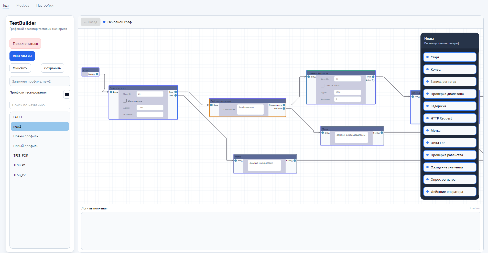
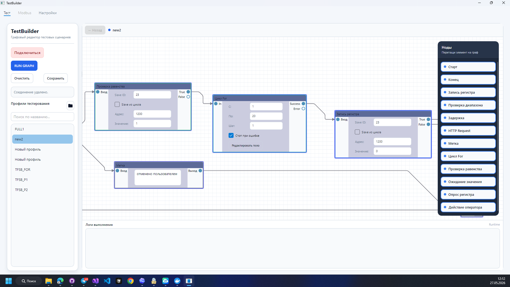
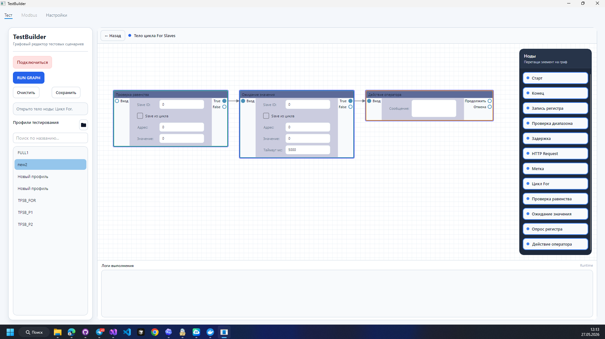
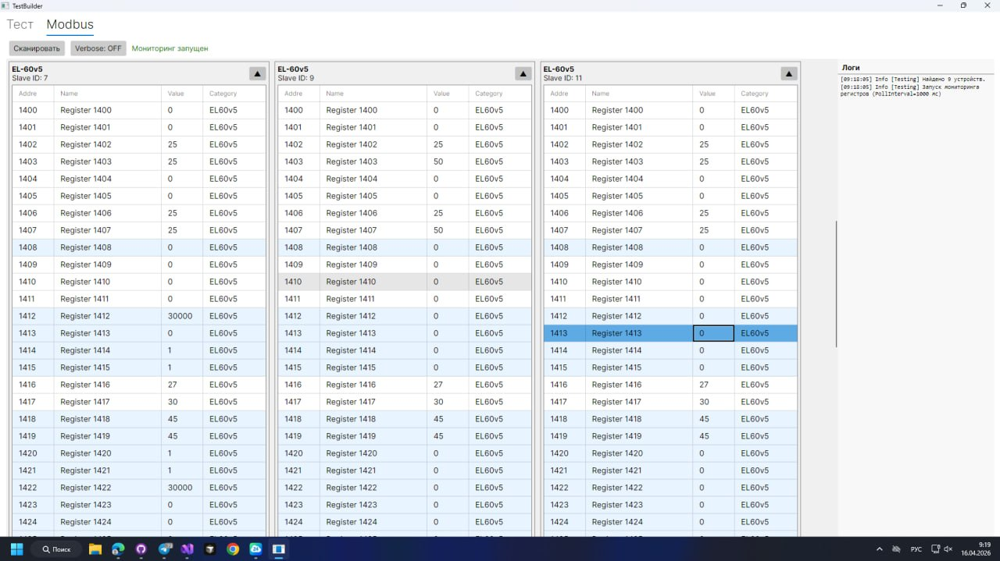

# TFortisTestBuilder


**TFortisTestBuilder** — desktop-приложение для визуального построения и выполнения автоматизированных тестовых сценариев для производственного тестирования оборудования.

Проект предназначен для инженерной автоматизации: вместо ручного запуска отдельных проверок оператор собирает сценарий в виде графа, подключается к тестовому стенду по COM-порту и запускает последовательность действий, связанных с Modbus RTU, регистрами, задержками, проверками условий и внешними HTTP-запросами.



## Зачем нужен проект

В производственном тестировании плат и готовых устройств часто приходится выполнять много повторяющихся операций:

- выбрать параметры подключения к стенду;
- подключиться к устройству по RS-485 / Modbus RTU;
- записать управляющее значение в регистр;
- подождать реакцию оборудования;
- считать состояние или измеренный параметр;
- сравнить значение с допустимым диапазоном;
- повторить те же действия для нескольких slave-устройств;
- зафиксировать результат проверки.

При ручном выполнении такие операции занимают время и легко приводят к ошибкам.  
TFortisTestBuilder решает эту проблему через визуальные тестовые сценарии: проверка описывается один раз, сохраняется в JSON-профиль и затем воспроизводимо выполняется через единый механизм исполнения.

## Что умеет приложение

- Визуальное создание тестовых сценариев в виде графа.
- Добавление, настройка, соединение и удаление нод.
- Выполнение сценария по переходам `Next`, `True`, `False`.
- Подключение к оборудованию через COM-порт.
- Обмен с устройствами по Modbus RTU.
- Чтение и запись Holding Registers.
- Проверка значений регистров.
- Ожидание значений и опрос регистров.
- Циклы по диапазону Modbus slave-устройств.
- Вложенные графы внутри составных нод.
- HTTP-запросы из тестового сценария.
- Операторские шаги для действий, которые пока требуют участия человека.
- Сохранение и загрузка тестовых профилей в JSON.
- Подсветка выполняемой ноды.
- Логирование процесса тестирования.
- Возможность тестировать часть логики без реального оборудования.

## Рабочий профиль в репозитории

Основной производственный профиль хранится в
`profiles/PSW_UPS_Box_8x2Pro_full_algorithm_polling.json` и отслеживается Git.
При запуске из рабочей копии приложение автоматически использует папку
`profiles`, если ранее выбранная папка не настроена или больше не существует.

После загрузки профиля обычная кнопка `Сохранить` перезаписывает этот же JSON.
Изменение сразу появляется в GitHub Desktop, поэтому на стендовую машину
достаточно доставить его обычным commit/push/pull. При публикации приложения
профиль также копируется в папку `profiles` рядом со сборкой.

## Скриншоты

### Основной редактор сценариев


### Цикл по Modbus slave-устройствам



### Вложенный граф внутри цикла



### Мониторинг Modbus-регистров



## Идея сценариев

Тест описывается как граф из нод.  
Каждая нода отвечает за одно конкретное действие: записать регистр, проверить значение, подождать, выполнить HTTP-запрос, вывести операторскую инструкцию или запустить вложенный цикл.
Такой подход удобен для тестирования оборудования, потому что сценарий можно читать как техническую карту проверки: сверху вниз видно, какие действия выполняются, где принимается решение и что происходит при ошибке.

## Поддерживаемые типы нод

| Нода | Назначение |
|---|---|
| `Start` | Начало тестового сценария |
| `End` | Завершение сценария |
| `Write Register` | Запись значения в Modbus-регистр |
| `Check Register Range` | Проверка попадания значения регистра в диапазон |
| `Check Register Equality` | Проверка значения регистра на равенство ожидаемому значению |
| `Wait Until` | Ожидание, пока регистр примет нужное значение |
| `Poll Register` | Опрос регистра и проверка серии значений |
| `Delay` | Пауза между действиями |
| `HTTP Request` | Выполнение HTTP-запроса во внешнюю систему или устройство |
| `Operator Action` | Инструкция оператору во время выполнения теста |
| `For Slaves` | Цикл по диапазону Modbus slave-устройств |
| `Body Start` / `Body End` | Границы вложенного графа внутри составной ноды |
| `Label` | Информационная метка для оформления сценария |

## Работа с Modbus RTU

Приложение использует Modbus RTU для взаимодействия с тестовым стендом и подключенными устройствами.

Через Modbus выполняются основные операции производственного теста:

- подключение через последовательный порт;
- чтение Holding Registers;
- запись одиночного регистра;
- проверка записи;
- мониторинг значений регистров;
- выполнение тестовых шагов, завязанных на состояние оборудования.

Modbus-логика вынесена в отдельный сервисный слой, поэтому сценарии тестирования не зависят напрямую от реализации работы с COM-портом.

## Архитектура

Проект построен с разделением пользовательского интерфейса, графовой структуры, бизнес-логики и инфраструктурных сервисов.

```text
TestBuilder
|
|-- Domain
|   |-- Execution       Исполнение графа, TestExecutor, TestNode, StepResult
|   |-- Steps           Атомарные шаги тестового сценария
|   |-- Modbus          Модели slave-устройств и регистров
|   |-- Monitoring      Состояние мониторинга регистров
|
|-- Services
|   |-- Modbus          Работа с COM-портом и Modbus RTU
|   |-- Http            Выполнение HTTP-запросов
|   |-- Logging         Логирование тестирования
|   |-- GraphCompiler   Компиляция визуального графа в исполняемый сценарий
|   |-- GraphSerializer Сохранение и загрузка графов
|
|-- ViewModels
|   |-- Graphs          Рабочие области графа
|   |-- NodifyVM        Ноды, коннекторы и связи
|   |-- StepVM          ViewModel конкретных тестовых шагов
|
|-- Views               Интерфейс на Avalonia UI
```

Ключевая идея архитектуры — разделение `Node` и `Step`.

`Node` отвечает за визуальную и графовую часть:

- положение на рабочем поле;
- входные и выходные коннекторы;
- связи с другими нодами;
- переходы `Next`, `True`, `False`;
- участие в визуальном сценарии.

`Step` отвечает за выполнение конкретной бизнес-операции:

- записать регистр;
- прочитать значение;
- проверить диапазон;
- выполнить задержку;
- отправить HTTP-запрос;
- вернуть результат выполнения.

Благодаря этому UI, графовая структура и реальная логика тестирования не смешиваются между собой.

## Как выполняется граф

```text
Visual Graph
    |
    v
GraphCompiler
    |
    v
CompiledGraph
    |
    v
TestExecutor
    |
    v
ITestStep
    |
    v
StepResult
    |
    v
Next / True / False
```

Порядок выполнения:

1. Пользователь собирает сценарий в визуальном редакторе.
2. `GraphCompiler` преобразует визуальные ноды в исполняемые `TestNode`.
3. `TestExecutor` запускает выполнение со стартовой ноды.
4. Каждая нода выполняет связанный с ней `ITestStep`.
5. Шаг возвращает результат: `Next`, `True`, `False` или `Stop`.
6. Исполнитель выбирает следующий переход.
7. UI получает события выполнения и подсвечивает активную ноду.
8. После завершения формируется итоговый статус сценария.

## Технологический стек

| Область | Технологии |
|---|---|
| Язык | C# |
| Платформа | .NET 8 |
| UI | Avalonia UI |
| Архитектура UI | MVVM |
| Графовый редактор | NodifyAvalonia |
| MVVM-инструменты | CommunityToolkit.Mvvm |
| Modbus | NModbus4 |
| COM-порт | System.IO.Ports |
| Сериализация | System.Text.Json |
| Тестирование | xUnit, coverlet |

## Почему проект интересен технически

Проект демонстрирует:

- разработку desktop-приложения на C# и Avalonia;
- применение MVVM в инженерном ПО;
- проектирование визуального редактора сценариев;
- компиляцию UI-графа в исполняемую модель;
- собственный исполнитель тестовых шагов;
- работу с внешним оборудованием через COM-порт;
- обмен по Modbus RTU;
- асинхронное выполнение операций;
- мониторинг регистров;
- сохранение сложной графовой структуры в JSON;
- расширяемую систему тестовых нод;
- отделение доменной логики от UI и инфраструктуры.

## Работа без оборудования

Часть логики можно разрабатывать и проверять без физического стенда.

Это возможно благодаря тому, что:

- шаги тестирования представлены через абстракции;
- Modbus-взаимодействие вынесено в отдельный сервис;
- граф компилируется в доменную модель;
- исполнитель сценария не зависит от Avalonia UI;
- отдельные шаги можно проверять через fake-реализации сервисов.

Такой подход упрощает разработку и позволяет тестировать основную логику без постоянного подключения к реальному устройству.

## Запуск проекта

Требования:

- .NET 8 SDK
- Windows / Linux / macOS с поддержкой Avalonia
- Для работы с реальным стендом: доступный COM-порт и устройство с Modbus RTU

Клонирование репозитория:

```bash
git clone https://github.com/kotyasmol/TFortisTestBuilder.git
cd TFortisTestBuilder
```

Восстановление зависимостей:

```bash
dotnet restore
```

Сборка:

```bash
dotnet build TestBuilder/TestBuilder.csproj
```

Запуск приложения:

```bash
dotnet run --project TestBuilder/TestBuilder.csproj
```

Запуск тестов:

```bash
dotnet test
```

## Формат тестовых профилей

Тестовые сценарии сохраняются в JSON.  
Профиль содержит список нод, их координаты, параметры и связи между коннекторами.

Упрощенный пример:

```json
{
  "name": "Example test",
  "nodes": [
    {
      "id": "0",
      "type": "Start",
      "x": 100,
      "y": 100
    },
    {
      "id": "1",
      "type": "Write Register",
      "slaveId": 1,
      "address": 1300,
      "value": 1,
      "x": 300,
      "y": 100
    },
    {
      "id": "2",
      "type": "End",
      "x": 500,
      "y": 100
    }
  ],
  "connections": [
    {
      "sourceNodeId": "0",
      "sourceConnector": "Next",
      "targetNodeId": "1",
      "targetConnector": "In"
    },
    {
      "sourceNodeId": "1",
      "sourceConnector": "Next",
      "targetNodeId": "2",
      "targetConnector": "In"
    }
  ]
}
```

## Статус проекта

Проект находится в активной разработке.

Сейчас реализована базовая архитектура визуального редактора, выполнение графовых сценариев, работа с Modbus RTU, мониторинг регистров, сохранение профилей и расширяемая система нод.

## Автор

Разработка: [kotyasmol](https://github.com/kotyasmol)

Репозиторий: [TFortisTestBuilder](https://github.com/kotyasmol/TFortisTestBuilder)
