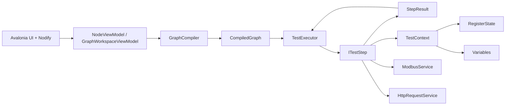

---
tags:
  - testbuilder
  - obsidian
  - documentation
updated: 2026-08-17
---

# TFortisTestBuilder

TFortisTestBuilder - desktop-приложение на .NET 8 и Avalonia для визуальной сборки и запуска производственных тестов оборудования. Пользователь собирает сценарий как граф нод, подключается к стенду по COM/Modbus RTU, запускает граф, а приложение последовательно выполняет Modbus-операции, HTTP-запросы, сетевые проверки, операторские действия, печать этикеток и отправку отчета.

Главная идея проекта: визуальная нода в редакторе не исполняется сама по себе. Она хранит параметры и коннекторы, затем компилируется в `TestNode`, внутри которого лежит runtime-шаг `ITestStep`. Шаг возвращает `StepResult`, а исполнитель выбирает следующий переход: `Next`, `True`, `False` или `Stop`.

## Актуальное состояние

Vault актуализирован по коду на 2026-06-30. В текущем `TestBuilder.slnx` подключены только два проекта:

- `TestBuilder/TestBuilder.csproj`;
- `TestBuilder.Tests/TestBuilder.Tests.csproj`.

Демонстрационные проекты Nodify `Nodify.Calculator` и `Nodify.StateMachine` удалены из рабочей копии и не являются частью решения. Локальная папка `nodify-avalonia-avalonia_port` остается только как сторонние исходники/справочный код; само приложение использует NuGet-пакет `NodifyAvalonia` версии `6.6.0`.

## Карта документации

- [[01 - Быстрый старт]] - как собрать, запустить, настроить папку профилей и начать тест.
- [[02 - Архитектура проекта]] - слои приложения, зависимости, основные классы и жизненный цикл.
- [[03 - Работа с приложением]] - вкладки, редактор графа, палитра, профили, логи, горячие клавиши.
- [[04 - Графы и выполнение]] - компиляция, переходы, вложенные графы, контекст, пауза, остановка, ошибки.
- [[05 - Справочник нод]] - детальное описание каждой ноды, ее параметров, выходов, JSON-полей и runtime-поведения.
- [[06 - JSON профили]] - формат сохранения графов, совместимость типов и вложенные `body`/`bodyGraph`.
- [[07 - Modbus и мониторинг]] - подключение, сканирование slave, `RegisterState`, авто-восстановление связи.
- [[08 - Модели устройств и регистры]] - поддерживаемые типы устройств и карты регистров.
- [[09 - HTTP сеть отчеты печать]] - HTTP-клиент, selftest, UDP set MAC, DataTest, отчеты и Zebra/ZPL.
- [[10 - Настройки логирование тесты]] - настройки приложения, UI-логгер, тестовый проект и покрытие.
- [[11 - Расширение проекта]] - как добавить новую ноду, новый шаг, JSON-поля и тесты.
- [[12 - Глоссарий]] - термины проекта.
- [[13 - Карта актуальности]] - сверка заметок с текущей структурой кода и список покрытых областей.
- [[14 - Реестр решений]] - принятые архитектурные, UX- и compatibility-решения.
- [[15 - Backlog и пожелания]] - кандидаты будущих работ, приоритеты и критерии готовности.
- [[16 - Статус проекта]] - оценка продуктовой готовности, вехи и риски.
- [[17 - Журнал проверок]] - результаты сборок, тестов, ручных и стендовых проверок.

## Где лежит код

```text
TestBuilder/
  Domain/
    Execution/      Исполнитель графа, TestNode, TestContext, StepResult
    Steps/          Runtime-логика нод
    Modbus/         Сканирование slave и модели устройств
    Monitoring/     RegisterState и фоновый мониторинг регистров
  Services/
    GraphCompiler.cs
    GraphSerializer.cs
    Modbus/
    Http/
    Logging/
  ViewModels/
    Graphs/
    NodifyVM/
    StepVM/
  Views/
    TestViews/
TestBuilder.Tests/
  StepTests/
  SerializationTests/
  MonitoringTests/
docs/
  profile_zero_completed.json
  PSW_UPS_Box_8x2Pro_test_graph.md
```

## Самые важные понятия

| Понятие | Что означает |
|---|---|
| `NodeViewModel` | Визуальная нода в редакторе Nodify: заголовок, позиция, коннекторы, параметры UI. |
| `ITestStep` | Исполняемый атомарный шаг теста. |
| `TestNode` | Узел runtime-графа, содержит `Step`, `Next`, `OnTrue`, `OnFalse`. |
| `GraphCompiler` | Преобразует `GraphWorkspaceViewModel` в `CompiledGraph`. |
| `TestExecutor` | Выполняет `TestNode` по результатам `StepResult`. |
| `TestContext` | Общий контекст запуска: регистры, переменные, текущий slave, observer, операторский prompt. |
| `RegisterState` | Потокобезопасное хранилище последних известных значений регистров. |
| `GraphSerializer` | Сохраняет и загружает графы в JSON-профили. |
| `For Slaves` | Составная нода, выполняющая вложенный граф для диапазона Modbus slave ID. |
| `Subtest` | Составная нода для логического подтеста с собственным вложенным графом. |

## Быстрая схема



## Текущий функциональный охват

Проект уже реализует:

- визуальный редактор графа на NodifyAvalonia;
- палитру нод с категориями;
- сохранение и загрузку JSON-профилей;
- вложенные графы для `Subtest` и `For Slaves`;
- undo/redo для базовых операций графа;
- запуск, паузу, продолжение и остановку теста;
- подсветку текущей и ошибочной ноды;
- подключение к Modbus RTU стенду через COM;
- сканирование устройств по slave ID;
- фоновый мониторинг регистров;
- авто-восстановление Modbus-соединения при критических ошибках;
- HTTP selftest и API-запросы к DUT/серверу;
- вычисление MAC из серийного номера;
- UDP-пакет установки MAC;
- программный DataTest через SharpPcap/Npcap;
- сбор JSON-отчета;
- печать Zebra/ZPL;
- отправку отчета на сервер и локальную копию;
- набор unit-тестов для ключевых шагов.

На уровне палитры сейчас доступно 28 нод в 5 категориях. Еще 2 технические ноды (`Body Start`, `Body End`) создаются внутри тела `For Slaves` и не добавляются из общей палитры.

## Важные ограничения

- Ноды проверки регистров (`Проверка диапазона`, `Проверка равенства`, `Ожидание значения`, `Опрос регистра`) читают не Modbus напрямую, а последнее значение из `RegisterState`. Значит, должен работать мониторинг и нужный slave должен быть найден.
- `ModbusWriteStep` пишет напрямую через `IModbusService`; при включенной проверке записи он дополнительно читает регистр и обновляет `RegisterState`.
- `For Slaves` задает только арифметический диапазон slave ID. Для произвольного списка устройств нужно несколько нод или новая нода.
- `WaitVariableUntil` умеет встроенно опрашивать только `GetUpsStatus`, `GetUpsVoltage`, `GetIrpStatus` или ничего (`None`).
- RAW-печать в `PrintLabel` работает только на Windows, потому что использует `winspool.drv`.
- `Build Test Report` при штатной работе всегда возвращает `True`; его выход `False` есть в UI как общий шаблон условных отчетных нод, но текущий step сам не возвращает `False`.
- `Selftest Check` при ошибке возвращает `False` всегда; параметр `FailOnError` влияет на `context.HasCriticalError`, а не на выбор ветки.
