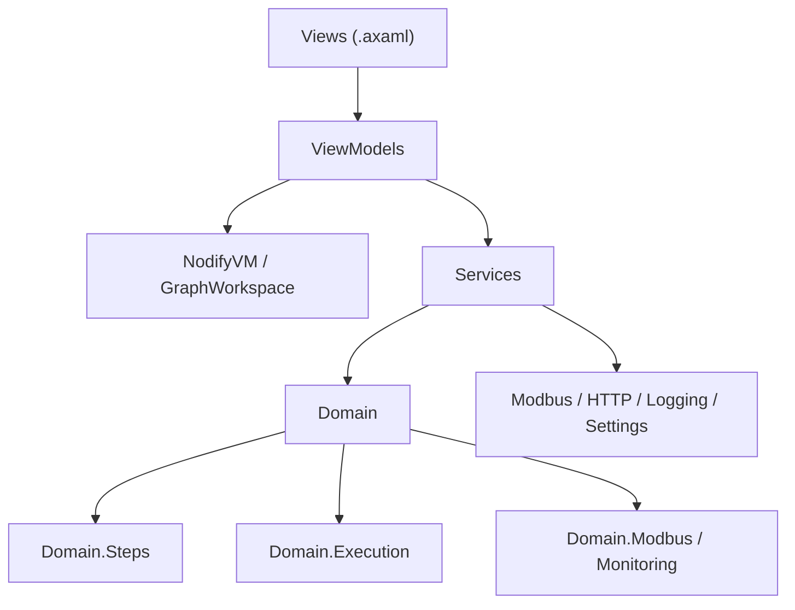
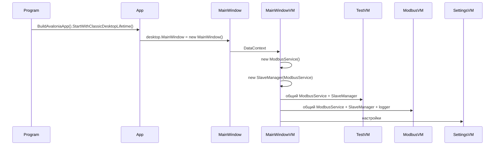
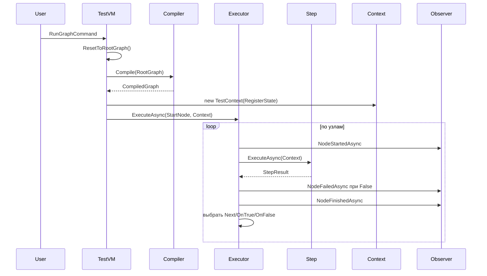

---
tags:
  - testbuilder
  - architecture
---

# Архитектура проекта

Проект построен как Avalonia desktop-приложение с MVVM, графовым редактором Nodify и отдельным доменным runtime для выполнения тестовых шагов.

## Слои



## Основные проекты

| Проект | Назначение |
|---|---|
| `TestBuilder` | Основное desktop-приложение. |
| `TestBuilder.Tests` | Unit-тесты runtime-логики, сериализации и мониторинга. |
| `nodify-avalonia-avalonia_port` | Локальные исходники Nodify. Основной проект при этом ссылается на пакет `NodifyAvalonia` версии `6.6.0`; демонстрационные проекты Nodify не входят в решение TestBuilder. |

## Технологический стек

| Область | Технология |
|---|---|
| Runtime | .NET 8 |
| Язык | C# |
| UI | Avalonia 11.1 |
| MVVM | CommunityToolkit.Mvvm |
| Графовый редактор | NodifyAvalonia |
| Modbus | NModbus4 + System.IO.Ports |
| HTTP | `HttpClient` |
| Packet capture/injection | SharpPcap |
| Сериализация | System.Text.Json |
| Тесты | xUnit, coverlet |

## Жизненный цикл приложения



`MainWindowViewModel` вручную создает общие сервисы. DI-контейнера в проекте нет.

## Главные ViewModel

| Класс | Роль |
|---|---|
| `MainWindowViewModel` | Создает общие `ModbusService`, `SlaveManager`, `TestViewModel`, `ModbusMonitoringViewModel`, `SettingsViewModel`. |
| `TestViewModel` | Центральная VM вкладки теста: граф, профили, подключение, запуск, пауза, stop, подсветка, observer. |
| `GraphWorkspaceViewModel` | Рабочая область одного графа: `Nodes`, `Connections`, `SelectedNodes`, `UndoRedo`. |
| `NodeViewModel` | Базовая визуальная нода. |
| `CompositeNodeViewModel` | Базовая нода с вложенным `BodyGraph`. |
| `ModbusMonitoringViewModel` | Вкладка просмотра slave и регистров. |
| `SettingsViewModel` | Папка профилей и тема. |

## Разделение Node и Step

В проекте есть два уровня одной и той же логики:

| Уровень | Пример | Ответственность |
|---|---|---|
| ViewModel | `ModbusWriteNodeViewModel` | UI-параметры, коннекторы, клонирование, сериализация. |
| Runtime step | `ModbusWriteStep` | Реальная запись Modbus, проверка, возврат `StepResult`. |

`GraphCompiler` связывает эти уровни.

Пример:

```text
ModbusWriteNodeViewModel
  Title = "Запись регистра"
  Input: Вход
  Output: True, False
  Parameters: SlaveId, Address, Value, UseCurrentSlaveId, VerifyWrite
      |
      v
GraphCompiler.CreateStep()
      |
      v
ModbusWriteStep.ExecuteAsync()
      |
      v
StepResult.True / StepResult.False
```

## Основные сервисы

| Сервис | Файл | Назначение |
|---|---|---|
| `GraphCompiler` | `TestBuilder/Services/GraphCompiler.cs` | Компиляция visual graph в runtime graph. |
| `GraphSerializer` | `TestBuilder/Services/GraphSerializer.cs` | JSON save/load. |
| `ModbusService` | `TestBuilder/Services/Modbus/ModbusService.cs` | COM-port, Modbus RTU, auto reconnect, read/write. |
| `SlaveManager` | `TestBuilder/Domain/Modbus/SlaveManager.cs` | Сканирование slave и выбор модели устройства. |
| `RegisterMonitor` | `TestBuilder/Domain/Monitoring/RegisterMonitor.cs` | Фоновый poll всех найденных slave и обновление `RegisterState`. |
| `HttpRequestService` | `TestBuilder/Services/Http/HttpRequestService.cs` | GET-запросы с timeout и нормализованным результатом. |
| `LoggingService` | `TestBuilder/Services/Logging/LoggingService.cs` | UI-логгер с коллекцией `LogEntry`. |
| `AppSettings` | `TestBuilder/Services/AppSettings.cs` | `graphsFolder` и `theme`. |
| `UndoRedoManager` | `TestBuilder/Services/Graph/UndoRedoManager.cs` | История команд графа до 50 операций. |

## Поток данных при запуске теста



## Состояние выполнения

`TestViewModel` реализует `IExecutionObserver`:

- `NodeStartedAsync` включает `IsExecuting`;
- `NodeFinishedAsync` выключает `IsExecuting`;
- `NodeFailedAsync` ставит `HasExecutionError`;
- для `SubtestNodeViewModel` дополнительно ведется прогресс вложенного графа.

`NodeViewModel` на основе этих флагов меняет рамку:

- обычная рамка - фиолетовая;
- выполняется - желтая;
- ошибка - красная.
