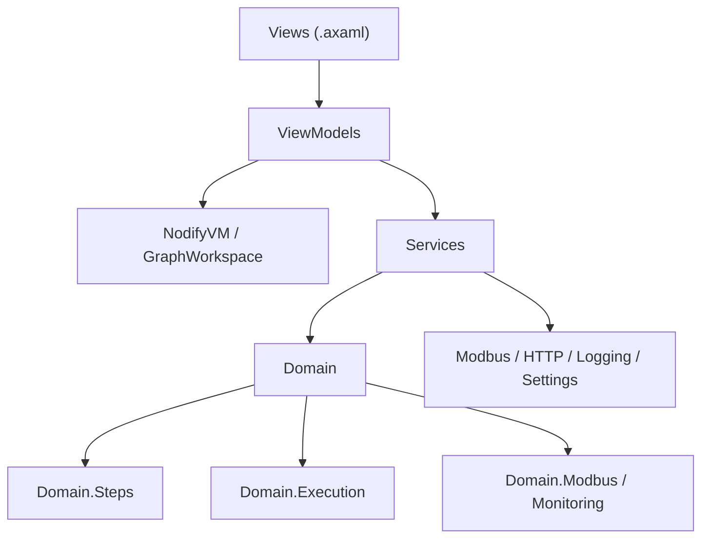
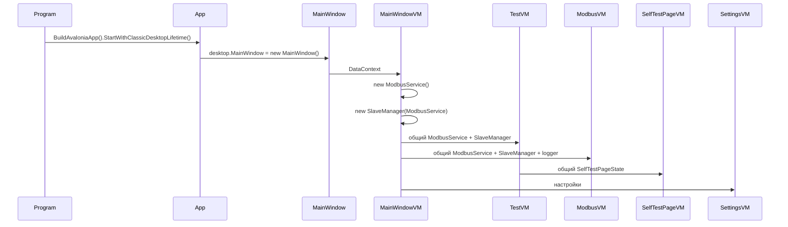
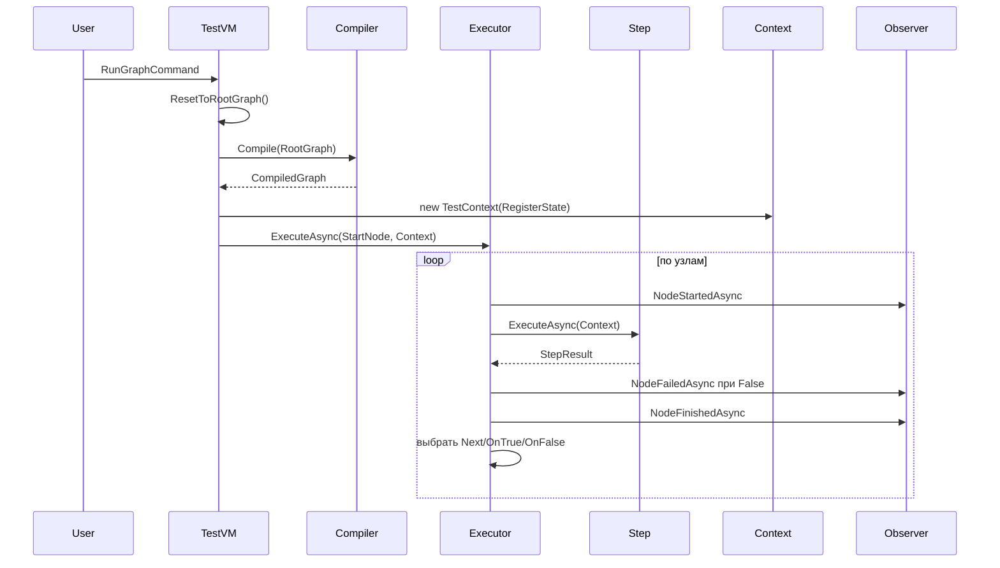

---
tags:
  - testbuilder
  - architecture
updated: 2026-10-01
---

# Архитектура проекта

## Пульт и контракт лаунчера (2026-10-01)

`LauncherOptions` разбирает session ID и имя; `App` хранит их только в памяти.
Режим интерфейса хранится в `AppSettings.EngineerMode` (по умолчанию `false`).
`SettingsViewModel` сохраняет выбор; `MainWindowViewModel` сразу переключает
`StationDashboardView` и инженерные вкладки с тем же `TestViewModel`. Кнопка
«Настройки» доступна в обоих режимах; изменение режима блокируется во время
проверки, cleanup и подключения, в том числе при прямой записи свойства VM.

Оба представления используют один `TestViewModel` и существующий `TestExecutor`.
`StationDashboardViewModel` проецирует уведомления выполнения в этапы и результат,
управляет ожиданием ответа оператора; `StationStageViewModel` хранит состояние,
номер и раскрываемый список внутренних операций этапа. Список программ пульта
использует общий каталог профилей с отдельным поиском и короткими именами;
фильтрация не перезагружает выбранный граф. `StationProfileGroupViewModel`
хранит модель и состояние раскрытия; `StationProfileOptionViewModel` —
конфигурацию, команду выбора и выделение. Группы строятся по метаданным
`GraphProfile.DeviceModel` / `ConfigurationName`; коллекции обновляются
точечно. Метаданные корня сохраняет `GraphSerializer` через
`GraphWorkspaceViewModel`. Общей шапки нет: настройки доступны
внизу боковой панели пульта или под инженерными вкладками.
Оркестрация подключения/запуска/cleanup пока остаётся в `TestViewModel`,
отдельный второй исполнитель или новый формат графа не добавлялись.

`TestViewModel.Station.cs` задаёт доступность команд. Мутации графа проверяют
`CanEditGraph` и при прямом вызове; холст выключен во время теста. Скрытый
редактор не обрабатывает Delete. Профиль блокируется до конца cleanup.

`GraphCompiler` владеет созданными по умолчанию HTTP-клиентами и освобождается
после выполнения. Внедрённый тестовый `IHttpRequestService` остаётся во владении
вызывающего кода. Для выдачи серийника используется отдельный клиент с сессией
лаунчера, для DUT — прежний HTTP-клиент без этой сессии.

Проект построен как Avalonia desktop-приложение с MVVM, графовым редактором Nodify и отдельным доменным runtime для выполнения тестовых шагов.

## Слои


```mermaid
flowchart TB
    Views["Views (.axaml)"] --> ViewModels["ViewModels"]
    ViewModels --> GraphVM["NodifyVM / GraphWorkspace"]
    ViewModels --> Services["Services"]
    Services --> Domain["Domain"]
    Domain --> Steps["Domain.Steps"]
    Domain --> Execution["Domain.Execution"]
    Domain --> ModbusDomain["Domain.Modbus / Monitoring"]
    Services --> Infrastructure["Modbus / HTTP / Logging / Settings"]
```

## Проекты решения

| Проект | Назначение |
|---|---|
| `TestBuilder` | Основное desktop-приложение. |
| `TestBuilder.Tests` | Unit-тесты runtime-логики, сериализации и мониторинга. |

`TestBuilder.slnx` больше не содержит демонстрационные проекты Nodify. Это важно для Visual Studio/Rider: при открытии решения должны отображаться только основной проект и тесты.

## Сторонние исходники рядом с проектом

| Папка | Роль |
|---|---|
| `nodify-avalonia-avalonia_port` | Локальные исходники Nodify/справочная копия. Основной проект при этом ссылается на NuGet-пакет `NodifyAvalonia` версии `6.6.0`, а не на проект из этой папки. |

## Технологический стек

| Область | Технология |
|---|---|
| Runtime | .NET 8 |
| Язык | C# |
| UI | Avalonia 11.1 |
| MVVM | CommunityToolkit.Mvvm |
| Графовый редактор | NodifyAvalonia |
| Modbus | NModbus4 + System.IO.Ports |
| HTTP | `HttpClient` |
| Packet capture/injection | SharpPcap |
| Сериализация | System.Text.Json |
| Тесты | xUnit, coverlet |

## Жизненный цикл приложения


```mermaid
sequenceDiagram
    participant Program
    participant App
    participant MainWindow
    participant MainWindowVM
    participant TestVM
    participant ModbusVM
    participant SelfTestPageVM
    participant SettingsVM

    Program->>App: BuildAvaloniaApp().StartWithClassicDesktopLifetime()
    App->>MainWindow: desktop.MainWindow = new MainWindow()
    MainWindow->>MainWindowVM: DataContext
    MainWindowVM->>MainWindowVM: new ModbusService()
    MainWindowVM->>MainWindowVM: new SlaveManager(ModbusService)
    MainWindowVM->>TestVM: общий ModbusService + SlaveManager
    MainWindowVM->>ModbusVM: общий ModbusService + SlaveManager + logger
    TestVM->>SelfTestPageVM: общий SelfTestPageState
    MainWindowVM->>SettingsVM: настройки
```

`MainWindowViewModel` вручную создает общие сервисы. DI-контейнера в проекте нет.

## Главные ViewModel

| Класс | Роль |
|---|---|
| `MainWindowViewModel` | Создает общие `ModbusService`, `SlaveManager`, `TestViewModel`, `ModbusMonitoringViewModel`, `SelfTestPageViewModel`, `SettingsViewModel`. |
| `TestViewModel` | Центральная VM вкладки теста: граф, профили, подключение, запуск, пауза, stop, подсветка, observer. |
| `GraphWorkspaceViewModel` | Рабочая область одного графа: `Nodes`, `Connections`, `SelectedNodes`, `UndoRedo`. |
| `NodeViewModel` | Базовая визуальная нода. |
| `CompositeNodeViewModel` | Базовая нода с вложенным `BodyGraph`; от нее наследуются `Subtest` и `For Slaves`. |
| `ModbusMonitoringViewModel` | Вкладка просмотра slave и регистров. |
| `SelfTestPageViewModel` | Проекция последнего `SelfTestPageState` в сворачиваемые bento-группы XML-полей DUT, сохранение UI-состояния и подсветка изменений. |
| `SettingsViewModel` | Папка профилей и тема. |

## Разделение Node и Step

В проекте есть два уровня одной и той же логики:

| Уровень | Пример | Ответственность |
|---|---|---|
| ViewModel | `ModbusWriteNodeViewModel` | UI-параметры, коннекторы, клонирование, сериализация. |
| Runtime step | `ModbusWriteStep` | Реальная запись Modbus, проверка, возврат `StepResult`. |

`GraphCompiler` связывает эти уровни.

Пример:

```text
ModbusWriteNodeViewModel
  Title = "Запись регистра"
  Input: Вход
  Output: True, False
  Parameters: SlaveId, Address, Value, UseCurrentSlaveId, VerifyWrite
      |
      v
GraphCompiler.CreateStep()
      |
      v
ModbusWriteStep.ExecuteAsync()
      |
      v
StepResult.True / StepResult.False
```

## Основные сервисы

| Сервис | Файл | Назначение |
|---|---|---|
| `GraphCompiler` | `TestBuilder/Services/GraphCompiler.cs` | Компиляция visual graph в runtime graph. |
| `GraphSerializer` | `TestBuilder/Services/GraphSerializer.cs` | JSON save/load. |
| `ModbusService` | `TestBuilder/Services/Modbus/ModbusService.cs` | COM-port, Modbus RTU, auto reconnect, read/write. |
| `SlaveManager` | `TestBuilder/Domain/Modbus/SlaveManager.cs` | Сканирование slave и выбор модели устройства. |
| `RegisterMonitor` | `TestBuilder/Domain/Monitoring/RegisterMonitor.cs` | Фоновый poll всех найденных slave и обновление `RegisterState`. |
| `HttpRequestService` | `TestBuilder/Services/Http/HttpRequestService.cs` | GET-запросы с timeout и нормализованным результатом. |
| `LoggingService` | `TestBuilder/Services/Logging/LoggingService.cs` | UI-логгер с коллекцией `LogEntry`. |
| `AppSettings` | `TestBuilder/Services/AppSettings.cs` | `graphsFolder` и `theme`. |
| `UndoRedoManager` | `TestBuilder/Services/Graph/UndoRedoManager.cs` | История команд графа до 50 операций. |

## Поток данных при запуске теста


```mermaid
sequenceDiagram
    participant User
    participant TestVM
    participant Compiler
    participant Executor
    participant Step
    participant Context
    participant Observer

    User->>TestVM: RunGraphCommand
    TestVM->>TestVM: ResetToRootGraph()
    TestVM->>Compiler: Compile(RootGraph)
    Compiler-->>TestVM: CompiledGraph
    TestVM->>Context: new TestContext(RegisterState)
    TestVM->>Executor: ExecuteAsync(StartNode, Context)
    loop по узлам
        Executor->>Observer: NodeStartedAsync
        Executor->>Step: ExecuteAsync(Context)
        Step-->>Executor: StepResult
        Executor->>Observer: NodeFailedAsync при False
        Executor->>Observer: NodeFinishedAsync
        Executor->>Executor: выбрать Next/OnTrue/OnFalse
    end
```

## Состояние выполнения

`TestViewModel` реализует `IExecutionObserver`:

- `NodeStartedAsync` включает `IsExecuting`;
- `NodeFinishedAsync` выключает `IsExecuting`;
- `NodeFailedAsync` ставит `HasExecutionError`;
- для `SubtestNodeViewModel` дополнительно ведется прогресс вложенного графа.

`NodeViewModel` на основе этих флагов меняет рамку:

- обычная рамка - фиолетовая;
- выполняется - желтая;
- ошибка - красная.

## Где чаще всего менять код

| Задача | Основные файлы |
|---|---|
| Добавить ноду | `Domain/Steps`, `ViewModels/StepVM`, `GraphCompiler`, `GraphSerializer`, `GraphDto`, `GraphEditorView.axaml`, `NodeTemplateSelector`, `TestViewModel`. |
| Изменить JSON-профиль | `GraphSerializer.cs`, `Serialization/GraphDto.cs`, тесты сериализации. |
| Изменить Modbus-карту | `Domain/Modbus/Models/*Model.cs`, при необходимости `SlaveManager.cs`. |
| Изменить выполнение графа | `Domain/Execution/TestExecutor.cs`, `TestContext.cs`, `GraphCompiler.cs`. |
| Изменить UI редактора | `Views/TestViews/GraphEditorView.axaml`, `ViewModels/NodifyVM`, `TestViewModel`. |
