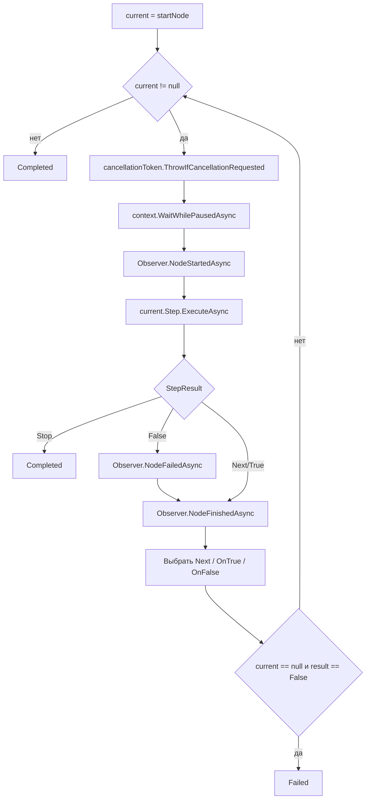

---
tags:
  - testbuilder
  - graph
  - execution
updated: 2026-07-15
---

# Графы и выполнение

## Модель визуального графа

`GraphWorkspaceViewModel` содержит:

| Свойство | Назначение |
|---|---|
| `Title` | Название графа или вложенного body graph. |
| `IsBodyGraph` | Признак вложенного графа. |
| `UsesBodyBoundaryNodes` | Используются ли специальные `Body Start`/`Body End`. |
| `UndoRedo` | История команд для данного графа. |
| `Nodes` | Визуальные ноды. |
| `Connections` | Связи между коннекторами. |
| `SelectedNodes` | Текущее выделение. |

Каждая `NodeViewModel` имеет:

- `Title`;
- `Location`;
- `IsSelected`;
- `IsExecuting`;
- `HasExecutionError`;
- `Input`;
- `Output`;
- `AvailableSlaves`;
- вычисляемые кисти рамки выполнения.

## Компиляция

`GraphCompiler.Compile(GraphWorkspaceViewModel graph)`:

1. Создает `Dictionary<NodeViewModel, TestNode>`.
2. Для каждой ноды вызывает `CreateStep(node)`.
3. Проходит по `graph.Connections`.
4. Для каждой связи определяет source/target-ноду.
5. Через `BindTransition` назначает `Next`, `OnTrue` или `OnFalse`.
6. Находит старт:
   - сначала `BodyStartNodeViewModel`;
   - если его нет, `StartNodeViewModel`.
7. Возвращает `CompiledGraph`.

Если стартовой ноды нет, выбрасывается `InvalidOperationException`.

Для `Check Register Range`, `Check Register Equality`, `Wait Until` и `Poll Register`
компилятор передает в шаги `IModbusService` и `ILogger`: эти ноды могут работать
по старому снимку `RegisterState` или, если включен флаг `LiveRead`, читать регистр
напрямую перед проверкой.

## Runtime-граф

`TestNode` содержит:

```csharp
public ITestStep? Step { get; init; }
public object? Source { get; init; }
public TestNode? Next { get; set; }
public TestNode? OnTrue { get; set; }
public TestNode? OnFalse { get; set; }
```

`Source` хранит исходную visual-ноду. Domain-слой не зависит от UI-типа, поэтому поле имеет тип `object?`.

## StepResult

| Значение | Значение для исполнителя |
|---|---|
| `Next` | Перейти в `current.Next`. |
| `True` | Перейти в `current.OnTrue`. |
| `False` | Перейти в `current.OnFalse`; если перехода нет, завершить граф как `Failed`. |
| `Stop` | Немедленно завершить текущий граф как `Completed`. |

`Stop` используется `BodyEndStep` внутри вложенных графов, чтобы завершить итерацию `For Slaves`.

## Исполнение

`TestExecutor.ExecuteAsync` работает циклом:



Если `Step.ExecuteAsync` бросает исключение, executor вызывает `NodeFailedAsync`, затем пробрасывает исключение выше. `RunGraphAsync` ловит исключение и пишет его в лог.

## TestContext

`TestContext` - общая память одного запуска:

| Свойство | Назначение |
|---|---|
| `RegisterMonitor` | Опциональная ссылка на монитор регистров. |
| `RegisterState` | Последние известные значения регистров. |
| `CancellationToken` | Токен запуска. |
| `IsConnected` | Снимок состояния подключения. |
| `ProfileName` | Имя профиля для отчета. |
| `HasCriticalError` | Флаг критической ошибки; влияет на `BuildTestReport`. |
| `CurrentSlaveId` | Текущий slave в `For Slaves`. |
| `ExecutionObserver` | Observer для подсветки UI. |
| `OperatorPrompt` | Делегат показа операторского диалога. |
| `WaitIfPausedAsync` | Делегат ожидания паузы. |
| `Variables` | Словарь переменных, которыми обмениваются шаги. |

Переменные используются для:

- результатов selftest (`Dut.*`);
- серийного номера;
- вычисленного MAC;
- результатов проверок (`LastCheck.*`);
- отчетов (`TestReportJson`);
- статусов HTTP/UDP/DataTest/печати.

## Пауза и остановка

`PauseTest()` заменяет `_pauseCompletion` на незавершенный `TaskCompletionSource`.

Каждая итерация executor перед запуском ноды вызывает:

```csharp
await context.WaitWhilePausedAsync(cancellationToken);
```

`ResumeTest()` завершает `_pauseCompletion`.

`StopTest()` отменяет `_testRunCts` и также снимает паузу, чтобы executor мог корректно выйти через `OperationCanceledException`.

Если основной запуск завершился `Failed`, был остановлен или выбросил исключение,
`RunGraphAsync` запускает аварийную очистку: все включенные `Subtest` с флагом
`RunOnFailure = true`. Такие подтесты компилируются отдельно из своего `BodyGraph`,
используют тот же `TestContext` и получают отдельный timeout 60 секунд. Пауза на
время cleanup отключается, чтобы остановленный тест не завис в ожидании Resume.

## Ошибки и ветвления

Условные ноды обычно имеют `True` и `False`.

Поведение зависит от подключенных переходов:

- `True` подключен - успешный путь продолжается.
- `False` подключен - ошибка обрабатывается альтернативной веткой.
- `False` не подключен - executor вернет `ExecutionStatus.Failed`.
- Шаг с параметром `FailOnError = false` может при внутренней ошибке вернуть `True`, но записать ошибку в переменные.

Исключения из общего правила:

- `Selftest Check` возвращает `False` при ошибке независимо от `FailOnError`; этот флаг влияет на `context.HasCriticalError`.
- `Build Test Report` при штатном выполнении возвращает `True` всегда.
- `EndStep` возвращает `Next`; завершение происходит потому, что после конечной ноды обычно нет следующего узла.

## Составные ноды

### For Slaves

`ForEachSlaveStep`:

1. Проверяет `from <= to`.
2. Для каждого slave ID задает:
   - `context.CurrentSlaveId`;
   - `context.Variables["slaveId"]`.
3. Запускает вложенный `CompiledGraph`.
4. Если вложенный граф не `Completed` и `StopOnError = true`, возвращает `False`.
5. После завершения сбрасывает `CurrentSlaveId`.
6. При успехе возвращает `Next`.

В `GraphCompiler.BindTransition` у `ForEachSlaveNodeViewModel`:

- `True`/`SuccessOut` назначается в `source.Next`;
- `False`/`ErrorOut` назначается в `source.OnFalse`.

### Subtest

`SubtestStep`:

- если `IsEnabled = false`, не запускает тело и возвращает `True`;
- если тело выполнено успешно, возвращает `True`;
- если тело failed и `StopOnError = false`, возвращает `False`;
- если тело failed и `StopOnError = true`, бросает `InvalidOperationException`.

В UI `SubtestNodeViewModel` показывает прогресс вложенных шагов.

`Subtest` использует тот же `TestContext`, что и родительский граф. Поэтому переменные, `CurrentSlaveId`, `HasCriticalError` и `RegisterState` не изолируются между вложенным и внешним графом.

`RunOnFailure` не меняет обычное поведение `SubtestStep`. Это флаг верхнего уровня:
`TestViewModel.RunGraphAsync` использует его, чтобы найти cleanup-подтесты после
провала, остановки или исключения основного графа.

## Коннекторы и BindTransition

Обычные линейные ноды попадают в `default` и получают `source.Next = target`.

Условные ноды назначают переходы явно:

- `True` -> `OnTrue`;
- `False` -> `OnFalse`.

Исключения:

- `Operator Action`: `Продолжить` -> `OnTrue`, `Отмена` -> `OnFalse`.
- `Subtest`: `Success` -> `OnTrue`, `Error` -> `OnFalse`.
- `For Slaves`: `True` -> `Next`, `False` -> `OnFalse`.
- `Body Start`: `PassThroughStep`, линейный `Next`.
- `Body End`: `BodyEndStep`, возвращает `Stop`.
