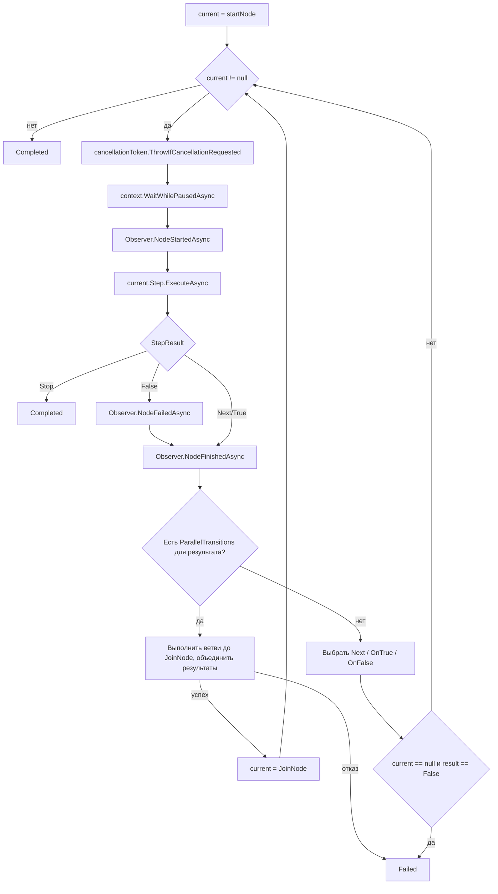

---
tags:
  - testbuilder
  - graph
  - execution
updated: 2026-10-01
---

# Графы и выполнение

## Представление выполнения в пульте (2026-10-01)

`IExecutionObserver.NodeCompletedAsync` передаёт фактический `StepResult` после
возврата шага. У метода есть default implementation для совместимости observer.
`NodeFinishedAsync` по-прежнему вызывается из finally, в том числе при исключении,
и не означает успех. Пульт завершает этап по результату корневой ноды этапа;
внутренняя False-ветка сама по себе не завершает весь подтест.

Пульт и редактор исполняют один граф. Отмена разблокирует inline-инструкцию,
затем исполняются существующие `RunOnFailure`-подтесты с отдельными токенами.
Пульт сохраняет прерванные этапы, показывает cleanup и отдельно отличает
неполный запуск, непройденные проверки и недоставленный отчёт.

## Модель визуального графа

`GraphWorkspaceViewModel` содержит:

| Свойство | Назначение |
|---|---|
| `Title` | Название графа или вложенного body graph. |
| `IsBodyGraph` | Признак вложенного графа. |
| `UsesBodyBoundaryNodes` | Используются ли специальные `Body Start`/`Body End`. |
| `UndoRedo` | История команд для данного графа. |
| `Nodes` | Визуальные ноды. |
| `Connections` | Связи между коннекторами. |
| `SelectedNodes` | Текущее выделение. |

Каждая `NodeViewModel` имеет:

- `Title`;
- `Location`;
- `IsSelected`;
- `IsExecuting`;
- `HasExecutionError`;
- `Input`;
- `Output`;
- `AvailableSlaves`;
- `SelectedColor` — выбранный пользователем цвет рамки; в заголовке ноды доступны семь цветов;
- вычисляемые кисти рамки выполнения.

## Компиляция

`GraphCompiler.Compile(GraphWorkspaceViewModel graph)`:

1. Создает `Dictionary<NodeViewModel, TestNode>`.
2. Для каждой ноды вызывает `CreateStep(node)`.
3. Проходит по `graph.Connections`.
4. Для каждой связи определяет source/target-ноду.
5. Через `ResolveTransition` определяет результат выхода; одна связь назначает
   `Next`, `OnTrue` или `OnFalse`, несколько связей создают параллельное ветвление.
6. Проверяет, что старт (`BodyStartNodeViewModel` или `StartNodeViewModel`) ровно один.
7. `ParallelGraphPlanner` находит обязательное общее объединение и проверяет
   структуру ветвей; `ParallelResourceValidator` проверяет допустимость ресурсов.
8. Возвращает `CompiledGraph` с планами `ParallelTransitions`.

Если стартовой ноды нет, выбрасывается `InvalidOperationException`.

Для `Check Register Range`, `Check Register Equality`, `Wait Until` и `Poll Register`
компилятор передает в шаги `IModbusService` и `ILogger`: эти ноды могут работать
по старому снимку `RegisterState` или, если включен флаг `LiveRead`, читать регистр
напрямую перед проверкой.

## Runtime-граф

`TestNode` содержит:

```csharp
public ITestStep? Step { get; init; }
public object? Source { get; init; }
public TestNode? Next { get; set; }
public TestNode? OnTrue { get; set; }
public TestNode? OnFalse { get; set; }
public Dictionary<StepResult, ParallelFork> ParallelTransitions { get; }
```

`Source` хранит исходную visual-ноду. Domain-слой не зависит от UI-типа, поэтому поле имеет тип `object?`.

`ParallelFork` содержит `Branches` и `JoinNode`. Это внутренний план выполнения,
а не дополнительная нода редактора. Он привязан к одному результату выхода;
`True` и `False` не запускаются одновременно.

## StepResult

| Значение | Значение для исполнителя |
|---|---|
| `Next` | Перейти в `current.Next`. |
| `True` | Перейти в `current.OnTrue`. |
| `False` | Перейти в `current.OnFalse`; если перехода нет, завершить граф как `Failed`. |
| `Stop` | Немедленно завершить текущий граф как `Completed`. |

`Stop` используется `BodyEndStep` внутри вложенных графов, чтобы завершить итерацию `For Slaves`.

## Исполнение

`TestExecutor.ExecuteAsync` работает циклом:


```mermaid
flowchart TD
    A["current = startNode"] --> B{"current != null"}
    B -->|нет| Z["Completed"]
    B -->|да| C["cancellationToken.ThrowIfCancellationRequested"]
    C --> D["context.WaitWhilePausedAsync"]
    D --> E["Observer.NodeStartedAsync"]
    E --> F["current.Step.ExecuteAsync"]
    F --> G{"StepResult"}
    G -->|Stop| H["Completed"]
    G -->|False| I["Observer.NodeFailedAsync"]
    I --> J["Observer.NodeFinishedAsync"]
    G -->|Next/True| J
    J --> P{"Есть ParallelTransitions для результата?"}
    P -->|да| Q["Выполнить ветви до JoinNode, объединить результаты"]
    Q -->|успех| R["current = JoinNode"]
    R --> B
    Q -->|отказ| M
    P -->|нет| K["Выбрать Next / OnTrue / OnFalse"]
    K --> L{"current == null и result == False"}
    L -->|да| M["Failed"]
    L -->|нет| B
```

Если `Step.ExecuteAsync` бросает исключение, executor вызывает `NodeFailedAsync`, затем пробрасывает исключение выше. `RunGraphAsync` ловит исключение и пишет его в лог.

Executor вызывается из UI-команды и сам не переносит все шаги в фон. Поэтому
каждый runtime-step должен использовать асинхронные API там, где это возможно,
и соблюдать переданный `CancellationToken`. `Selftest Check` раз в заданный
интервал проверяет доступность DUT через ICMP/TCP, а браузерный жизненный цикл
выполняет в фоновой задаче только после появления устройства. Между попытками
нет состояния, способного запретить следующий опрос.

## TestContext

`TestContext` - общая память одного запуска:

| Свойство | Назначение |
|---|---|
| `RegisterMonitor` | Опциональная ссылка на монитор регистров. |
| `RegisterState` | Последние известные значения регистров. |
| `CancellationToken` | Токен запуска. |
| `IsConnected` | Снимок состояния подключения. |
| `ProfileName` | Имя профиля для отчета. |
| `HasCriticalError` | Флаг критической ошибки; влияет на `BuildTestReport`. |
| `CurrentSlaveId` | Текущий slave в `For Slaves`. |
| `ExecutionObserver` | Observer для подсветки UI. |
| `OperatorPrompt` | Делегат показа операторского диалога. |
| `WaitIfPausedAsync` | Делегат ожидания паузы. |
| `SelfTestPageState` | Общая с UI ссылка на последний полный снимок XML тестовой страницы, его URL и состояние загрузки. |
| `Variables` | Словарь переменных, которыми обмениваются шаги. |
| `ReportEntries` | Упорядоченные результаты `Subtest` для построчного отчета. |
| `ExecutionScopeId`, `ParentExecutionScopeId` | Область выполнения и родитель параллельной ветви для маршрутизации прогресса. |
| `ParallelBranchResults` | Результаты и отдельные снимки переменных завершённых ветвей. |

`Variables` реализован через `ContextVariables` с отслеживанием записей.
Параллельные ветви получают отдельные копии изменяемых переменных, свой slave
и результаты. Общими остаются сервисы и `RegisterState`. При объединении
конфликтующие публичные записи дают ошибку; неоднозначные `LastCheck.*` и
`WaitVariable.*` остаются только в диагностике ветвей. Отчёт объединяется
по порядку связей, а не по скорости завершения.

Переменные используются для:

- результатов selftest (`Dut.*`);
- серийного номера;
- вычисленного MAC;
- результатов проверок (`LastCheck.*`);
- отчетов (`TestReportText`);
- статусов HTTP/UDP/DataTest/печати.

## Пауза и остановка

`PauseTest()` заменяет `_pauseCompletion` на незавершенный `TaskCompletionSource`.

Каждая итерация executor перед запуском ноды вызывает:

```csharp
await context.WaitWhilePausedAsync(cancellationToken);
```

`ResumeTest()` завершает `_pauseCompletion`.

`IsTestPaused` означает запрос паузы и блокирует ответ на inline-инструкцию.
`IsPauseEffective` подтверждает, что executor действительно ожидает перед
следующей операцией (либо уже ожидает действия оператора). До этого пульт
показывает «Пауза после текущего шага»: текущий HTTP/Modbus/Delay не прерывается.
После выхода из ожидания executor повторно проверяет cancellation token,
поэтому снятие паузы при остановке не запускает следующую операцию.

`StopTest()` отменяет `_testRunCts` и также снимает паузу, чтобы executor мог корректно выйти через `OperationCanceledException`.

Перед запуском `GraphConnectionRequirements` рекурсивно проверяет корневой и
вложенные графы. Активные `ModbusWrite`, проверки регистров, `WaitUntil` и
`PollRegister` требуют `IsConnected = true`; граф только с `Print Label` и
другими независимыми шагами может выполняться без подключения. Тело выключенного
`Subtest` не создаёт требование к стенду, потому что исполняться не будет.

Если основной запуск завершился `Failed`, был остановлен или выбросил исключение,
`RunGraphAsync` запускает аварийную очистку: все включенные `Subtest` с флагом
`RunOnFailure = true`. Такие подтесты компилируются отдельно из своего `BodyGraph`,
используют тот же `TestContext` и получают отдельный timeout 60 секунд;
если в непосредственном `BodyGraph` есть `Operator Action`, timeout равен
5 минутам. Пауза на
время cleanup отключается, чтобы остановленный тест не завис в ожидании Resume.

## Ошибки и ветвления

Условные ноды обычно имеют `True` и `False`.

Поведение зависит от подключенных переходов:

- `True` подключен - успешный путь продолжается.
- `False` подключен - ошибка обрабатывается альтернативной веткой.
- `False` не подключен - executor вернет `ExecutionStatus.Failed`.
- Шаг с параметром `FailOnError = false` может при внутренней ошибке вернуть `True`, но записать ошибку в переменные.

Исключения из общего правила:

- `Selftest Check` возвращает `False` при ошибке независимо от `FailOnError`; этот флаг влияет на `context.HasCriticalError`.
- `Build Test Report` возвращает `False`, если не задан `Stand ID`
  или нет полного положительного `SerialNumber`; иначе `True`.
- `EndStep` возвращает `Next`; завершение происходит потому, что после конечной ноды обычно нет следующего узла.

## Составные ноды

### For Slaves

`ForEachSlaveStep`:

1. Проверяет `from <= to`.
2. Для каждого slave ID задает:
   - `context.CurrentSlaveId`;
   - `context.Variables["slaveId"]`.
3. Запускает вложенный `CompiledGraph`.
4. Если вложенный граф не `Completed` и `StopOnError = true`, возвращает `False`.
5. В `finally` восстанавливает предыдущие `CurrentSlaveId` и `slaveId`, в том числе при отмене и во вложенном цикле.
6. При успехе возвращает `Next`.

В `GraphCompiler.ResolveTransition` у `ForEachSlaveNodeViewModel`:

- `True`/`SuccessOut` назначается в `source.Next`;
- `False`/`ErrorOut` назначается в `source.OnFalse`.

### Subtest

`SubtestStep`:

- если `IsEnabled = false`, не запускает тело и возвращает `True`;
- если тело выполнено успешно, возвращает `True`;
- если тело failed и `StopOnError = false`, возвращает `False`;
- если тело failed и `StopOnError = true`, помечает `context.HasCriticalError = true`
  и возвращает `False` без `InvalidOperationException`.

В UI `SubtestNodeViewModel` показывает прогресс вложенных шагов.

`Subtest` использует тот же `TestContext`, что и вызывающая область выполнения.
В последовательном графе это родительский контекст; внутри параллельного участка
это отдельный контекст соответствующей ветви.

`RunOnFailure` не меняет обычное поведение `SubtestStep`. Это флаг верхнего уровня:
`TestViewModel.RunGraphAsync` использует его, чтобы найти cleanup-подтесты после
провала, остановки или исключения основного графа.

## Коннекторы и переходы

Обычный линейный выход соответствует `Next`. Одна связь задаёт `source.Next`;
несколько — план параллельных ветвей этого результата.

Условные ноды назначают переходы явно:

- `True` -> `OnTrue`;
- `False` -> `OnFalse`.

Исключения:

- `Operator Action`: `Продолжить` -> `OnTrue`, `Отмена` -> `OnFalse`.
- `Subtest`: `Success` -> `OnTrue`, `Error` -> `OnFalse`.
- `For Slaves`: `True` -> `Next`, `False` -> `OnFalse`.
- `Body Start`: `PassThroughStep`, линейный `Next`.
- `Body End`: `BodyEndStep`, возвращает `Stop`.

## Параллельное выполнение

Несколько связей одного выхода запускают ветви одновременно. Общая следующая
нода ждёт все ветви этого разветвления и выполняется один раз. Вложенные
разветвления поддерживаются; пересечения ветвей, неоднозначные объединения,
успешное завершение до объединения и циклы внутри параллельного участка
отклоняются компилятором, включая циклы связей во вложенных телах.

Необработанный отказ отменяет соседние ветви. Исполнитель ждёт их выхода
до запуска root cleanup; завершение браузерной попытки входит в это ожидание.
Отмена не вызывает `NodeFailedAsync`, а завершающие уведомления observer
получают неотменённый токен. Прогресс UI и ожидание паузы учитываются по scope,
пульт показывает несколько одновременно активных этапов.

Схема Pro-профиля, ограничения оборудования, переменные, совместимость JSON
и тесты — [[23 - Параллельное выполнение проверок]].
