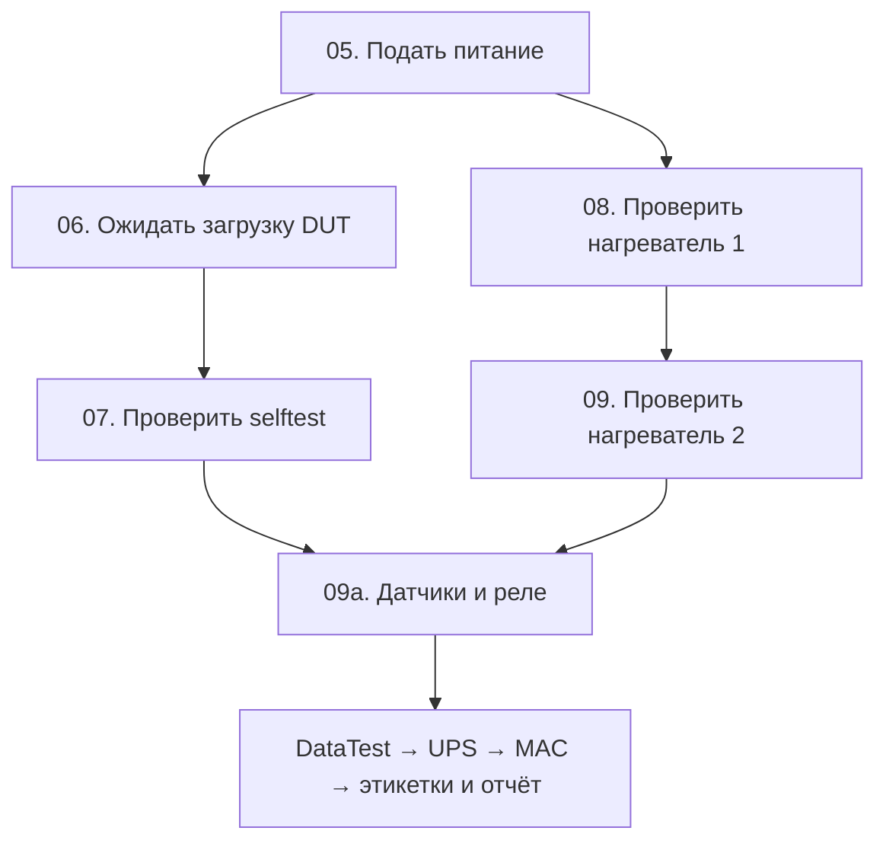

---
tags:
  - testbuilder
  - execution
  - performance
updated: 2026-10-02
---

# Параллельное выполнение проверок

Параллелизм реализован через обычные связи редактора: несколько стрелок из
одного выхода запускают ветви одновременно. Дополнительная нода не нужна.
Компилятор находит общую следующую ноду; она выполняется один раз, когда
все запущенные ветви достигли её успешно. `True` и `False` остаются
альтернативными выходами. Ветвление работает и внутри составных нод.

## Профиль Pro

Новая копия —
[PSW_UPS_Box_8x2Pro_parallel_start.json](../../profiles/PSW_UPS_Box_8x2Pro_parallel_start.json).
В пульте это конфигурация «Полная проверка · параллельный старт» модели
`PSW+UPS-Box 8x2Pro`. Исходный последовательный профиль сохранён. Параметры
оборудования, допуски, вложенные графы, последующие проверки и аварийная
очистка перенесены без изменения.

`05.Success` имеет две связи. Первая ветвь выполняет `06 → 07`, вторая —
`08 → 09`. Нода 09a является барьером: не запускается, пока обе ветви не
завершены. Нагреватели остаются последовательными между собой.

Пользователь подтвердил независимость физической загрузки от нагревателей.
JSON также не содержит зависимости нагревателей от `Dut.*`: управление и ток
читаются через PS-3 slave 23, регистры `1215/1216` и `1220/1221`, с
`liveRead=true`. Ветви не меняют AC1/AC2; подача питания остаётся перед ними.

В нагревателях **12 секунд явных задержек плюс обмен Modbus**: `5+2` с и
`3+2` с. Если `S` — время `06 → 07`, а `H` — время `08 → 09`, то участок
занимает примерно `max(S,H)` вместо `S+H`. Это расчёт ожидаемого выигрыша;
фактическое ускорение на Windows-стенде ещё не измерялось. Timeout Selftest
300 с — предел ожидания, не обязательная длительность шага.

## Профиль Pro с параллельными нагрузками

`profiles/PSW_UPS_Box_8x2Pro_parallel_el60.json` — отдельная копия актуального
профиля с параллельным стартом. В пульте: модель `PSW+UPS-Box 8x2Pro`,
конфигурация **«Полная проверка · параллельный старт и нагрузки»**.

В этапах `02. Сброс PoE-нагрузок EL60v5` и
`04. Настройка PoE-нагрузок EL60v5` один цикл `1..15, шаг 2` заменён тремя
параллельными `For Slaves`: `1..5`, `7..11`, `13..15`, у всех шаг 2.
В каждом этапе связи идут от одного `Start` к трём циклам и от их `True`
к общему `End`. Следующий этап ждёт все три группы; внутри группы устройства
обрабатываются последовательно. Вложенные `Start` помечены `parallel v1`.

Все команды, значения регистров, read-back и задержки каждого устройства
сохранены. `UseCurrentSlaveId=true`, диапазоны не пересекаются,
`StopOnError=true`; неподключённый `False` останавливает участок с отменой
соседних ветвей, после чего действует прежняя аварийная очистка.
Корневые связи, совмещение загрузки DUT с нагревателями и отключённый
Sensor1/Sensor2 перенесены из базового профиля без изменения.

COM по-прежнему обслуживает один запрос за раз с интервалом 150 мс.
Перекрываются ожидания: в сбросе сохранены 4 секунды задержек на устройство,
в настройке — 0,7 секунды. Аппаратное ускорение нового варианта не измерено.
Проверки профиля — `ParallelGraphCompilationTests`: неизменность остальных
этапов и тела каждой итерации, диапазоны, общий барьер, компиляция и round-trip.

## Правила построения графа

| Ситуация | Поведение |
| --- | --- |
| Одна связь выхода | Прежнее последовательное выполнение. |
| Несколько разных целей одного выхода | Параллельный запуск всех целей выбранного выхода. Порядок связей задаёт порядок объединения результатов. |
| `True` и `False` ведут в разные пути | Выбирается только один выход; схождение альтернатив не ждёт невыбранный путь. На каждом выходе может быть собственное параллельное ветвление. |
| Общая следующая нода | Исполняется один раз после всех ветвей соответствующего разветвления. |
| Вложенное разветвление | Поддерживается при однозначном внутреннем и внешнем объединении. |
| Повторная идентичная связь | Отклоняется редактором; компилятор также выдаёт ошибку. |
| Нет общей ноды или успешный путь заканчивается раньше неё | Ошибка компиляции до начала теста. Отдельные конечные ноды не считаются общим объединением. |
| Частичное схождение, переход между соседними ветвями, внешний вход в середину ветви | Ошибка компиляции: ветви должны иметь раздельные участки до общего барьера. |
| Цикл внутри участка между разветвлением и объединением | Ошибка компиляции. Обычные последовательные циклы вне такого участка сохраняются; `For Slaves` остаётся штатной составной нодой. |
| Неподключённый `False` в ветви | Необработанный отказ, отмена соседей и выход к аварийной очистке. |
| `False` с обработанным переходом | Обычное условное ветвление; само значение `False` не отменяет соседей, если нет критической ошибки. |

Компиляция проверяет все явно подключённые пути, а не только ожидаемый
«успешный» сценарий. Выход ошибки внутри параллельного участка либо обрабатывается
там с возвращением к общему объединению, либо остаётся неподключённым для
остановки. Аварийные `RunOnFailure`-подтесты остаются в корневом графе.

Это структурные правила, а не глобальное ожидание всех входящих стрелок:
такое ожидание зависло бы на невыбранной стороне `True/False`.

## Контекст и результаты

У каждой ветви свой `TestContext` с `ExecutionScopeId` и ссылкой на родительскую
область. Копируются входные переменные и записи отчёта; `CurrentSlaveId` и
`slaveId` не смешиваются с соседями. Регистровое хранилище и сервисы стенда
общие. Вложенный последовательный Subtest использует контекст своей ветви.

Скалярные значения, массивы, `List` и `Dictionary` копируются без общего
изменяемого содержимого. Неподдерживаемые и циклические значения отклоняются
с диагностикой. Замена обычного словаря на `ContextVariables` позволяет
отслеживать даже запись того же значения, которое было на входе.

На объединении непересекающиеся изменения переменных переносятся в родителя.
Одинаковые записи совместимы; разные записи одного публичного ключа дают
ошибку с именем переменной и номерами ветвей. Данные между ветвями до барьера
не передаются: ожидание результата соседней ветви следует размещать после
объединения.

Служебные `LastCheck.*` и `WaitVariable.*` при нескольких пишущих ветвях
не получают произвольного глобального победителя: неоднозначное пространство
имён удаляется из родительских переменных, а подробности остаются в
`ParallelBranchResults`. Публичные выходные переменные нужно именовать отдельно.

Новые записи отчёта добавляются в порядке ветвей профиля, независимо от
порядка завершения. Сохраняются частичные результаты, ошибки и отменённые
подтесты. Критические ошибки объединяются через OR. Финальный отчёт собирается
после барьера; его создание внутри ветви запрещено.

## Отмена и пауза

Первый необработанный отказ, исключение или критическая ошибка отменяет
остальные ветви. Исполнитель дожидается их выхода и только затем возвращает
управление родителю. Исходная ошибка сохраняется, отменённый сосед отображается
как прерванный, а не как самостоятельный отказ изделия. Команда Stop отменяет
все области, включая вложенные разветвления.

Отмена браузерной selftest-попытки теперь ждёт её worker и штатное завершение
Chrome; поздний worker не остаётся работать за пределами завершившейся ветви.
Алгоритм ожидания DUT, исходный URL, таймауты, интервалы и чтение DOM сохранены.

`Clear ARP Cache` также завершает дерево своего процесса и ждёт выхода при
отмене/таймауте. Stdout и stderr читаются одновременно, чтобы заполнение
канала не блокировало процесс. Ошибка остановки не скрывается `FailOnError=false`.

Пауза запрещает начало новых операций во всех ветвях. Уже выполняющиеся
Modbus/HTTP/Delay могут завершаться; физическая загрузка устройства продолжается.
Пульт показывает подтверждённую паузу только когда все активные атомарные
операции завершены или ожидают паузу. Stop работает и во время паузы.

## Оборудование и ограничения

`ModbusService` сохраняет последовательную очередь запросов и межзапросный
интервал 150 мс. Параллельность перекрывает ожидания физического процесса и
сети, не отправляет несколько команд одновременно в один COM-порт.

Компилятор консервативно проверяет ресурсы всех возможных действий ветви,
включая вложенные активные Subtest и диапазоны `For Slaves`:

- один Modbus slave нельзя использовать из разных параллельных ветвей,
  даже если регистры различаются: очередь COM не защищает целую последовательность
  «записать → подождать → измерить»;
- сетевые шаги DUT/selftest/ARP/DataTest разных ветвей считаются общим ресурсом
  и не выполняются одновременно;
- записи разрешены только для нагревателей `1215/1220` и настройки EL60
  `1412/1413/1414/1415/1420/1421/1430`. Настройка EL60 конфликтует с сетевыми
  измерениями соседней ветви. Прочие записи (питание, SIMBAT, датчики, разряд)
  должны находиться вне параллельного участка;
- действия оператора, выдача серийника, запись MAC/прошивки, печать, отчёт и
  аварийная очистка внутри участка запрещены;
- новый неизвестный тип ноды требует явного описания допустимых ресурсов
  в `ParallelResourceValidator`, прежде чем его можно будет распараллелить.

Разрешённое сочетание в новом профиле — одна сетевая ветвь и одна ветвь
нагревателей. Проверка известных программных ресурсов не доказывает
электрическую независимость произвольного оборудования: она определяется
методикой и подключением стенда.

## Редактор и пульт

Редактор позволяет несколько связей одного выхода; дубликаты и связи неверного
направления не добавляются. Текущие ноды обеих ветвей подсвечиваются одновременно.

Прогресс подтестов учитывается по области исполнения вместо одного общего
стека. Пульт показывает одновременно активные этапы; внутри каждого — постоянную
строку с номерами и названиями активных шагов тела («Шаги 1, 2 из 3 — …»).
Вложенные подтесты и циклы считаются одним шагом, без смены подписи на каждом
внутреннем действии. При завершении последнего шага подпись сохраняется.
Завершённая ветвь остаётся завершённой, пока другая работает; общая следующая
стадия расположена после обеих ветвей и остаётся ожидающей до барьера.

## Формат и совместимость

Новых нод и новых полей связей нет. Несколько элементов `connections` с
одинаковыми `sourceNodeId` и `sourceConnector` обозначают параллельный выход.

При сохранении графа с разветвлением (включая вложенный граф) старт имеет
JSON-тип `Start (parallel v1)` или `Body Start (parallel v1)`. Новое приложение
отображает обычную стартовую ноду. Старый загрузчик отклоняет неизвестный тип,
вместо того чтобы молча выполнить только последнюю ветвь. Для последовательных
профилей сохраняются прежние `Start`/`Body Start`.

Загрузчик сначала разбирает полный профиль во временный граф. Неизвестная версия,
дублирующиеся ID, отсутствующие ноды и неверные коннекторы дают ошибку без
удаления открытого графа. Проверка топологии и ресурсов выполняется компилятором
перед запуском, поэтому незаконченную схему можно редактировать и сохранять.

## Дальнейшее ускорение

Чередование EL60v5 с разными slave включено в отдельный профиль
`parallel_el60`, описанный выше; профиль `parallel_start` сохраняет прежние
циклы. Другие резервы пока не включены: повторное использование снимка между
06 и 07, сокращение четырёх межпарных пауз DataTest по 5 с.
Одновременные пары DataTest требуют проверки пропускной способности CPU/Npcap;
см. [[22 - Инцидент сетевых карт 2026-09-28]]. UPS, перезапуск, запись MAC и
зависимые сетевые проверки сохраняют исходный порядок.

Важное ограничение исходного алгоритма: у нагревателя 1 после включения и
после выключения задано `0..1500`; у второго — `150..1000` и `0..50`.
Первый допуск не подтверждает появление и спад тока. Эти значения перенесены
в копию без изменения и требуют отдельного уточнения методики.

Реализация: [GraphCompiler](../../TestBuilder/Services/GraphCompiler.cs),
[ParallelGraphPlanner](../../TestBuilder/Services/Graph/ParallelGraphPlanner.cs),
[ParallelResourceValidator](../../TestBuilder/Services/Graph/ParallelResourceValidator.cs),
[TestExecutor](../../TestBuilder/Domain/Execution/TestExecutor.cs),
[TestContext](../../TestBuilder/Domain/Execution/TestContext.cs).
Проверки компиляции/профиля, runtime и UI находятся соответственно в
`ParallelGraphCompilationTests`, `ParallelExecutionTests`, `ParallelExecutionUiTests`.
Результаты запусков и границы проверки — [[17 - Журнал проверок]].

Связанные заметки: [[04 - Графы и выполнение]], [[06 - JSON профили]],
[[07 - Modbus и мониторинг]], [[18 - Selftest и загрузка DUT]],
[[21 - PSW+UPS-Box 8x2Pro тестирование]].
